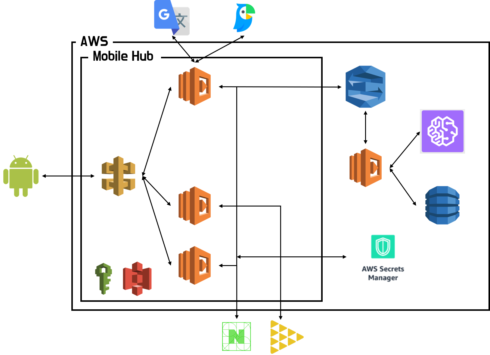
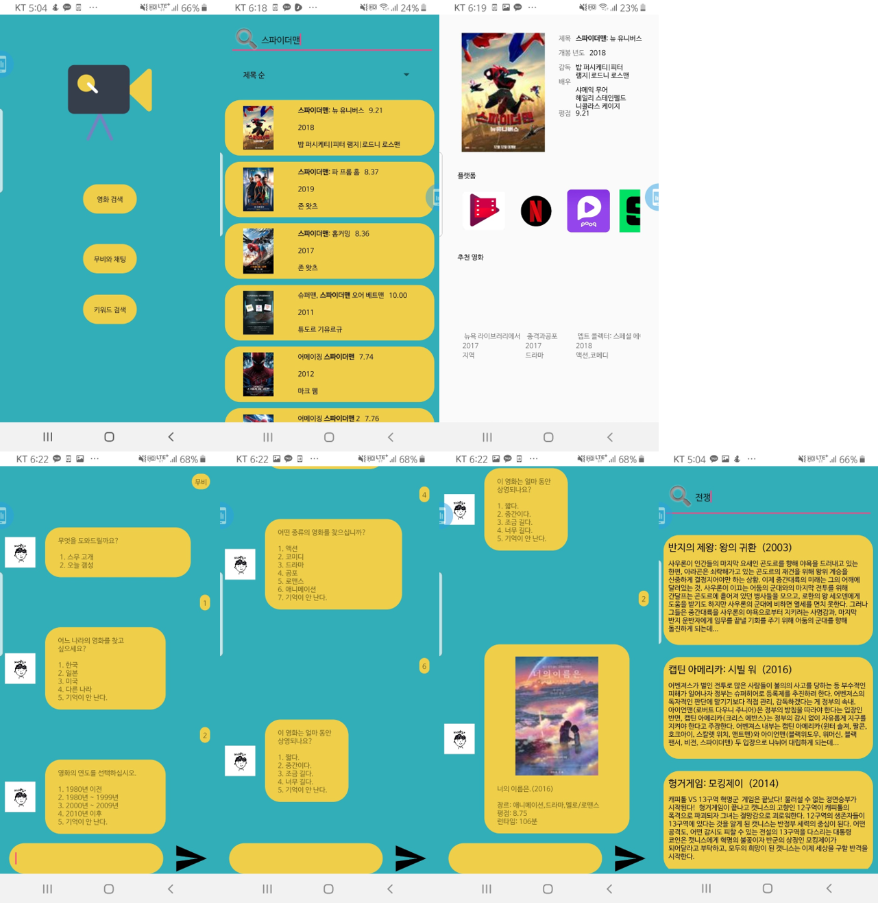

<h1 align="center">Today's Movie - 오늘 몇 편👋</h1>

  
  
  
  

> 오늘 몇 편은 키워드에 따른 영화 정보 및 영화 제공 플랫폼 정보를 제공하며, 챗봇을 통해 기분에 따른 영화를 추천받을 수 있는 서비스입니다.

### 🏠 [Homepage](https://github.com/seed-kau/Todays-Movie)

### Description
1. 보고 싶은 영화가 어느 플랫폼에 위치해 있는지와 영화 정보를 제공한다.

2. AWS Lex를 이용하여 유저의 성향과 상황에 맞춘 오늘의 영화를 추천해준다.

3. 키워드 검색을 통해 유저가 기억하고 싶은 영화 정보를 검색해준다.

자세한 내용은 [다음](./Today's%20Movie.pdf)을 참고해주세요.

### Architecture

- 언어 번역 : `Google Cloud Translation`, `Naver Papago NMT API`
- 영화 검색 : `한국영화 진흥원 API`, `Naver 영화 검색 API`, `JustWatch API`, `The MovieDB API`
- 챗봇 : `AWS Comprehend`, `AWS Lex`
- 서버, 보안 : `AWS Lambda`, `AWS API Gateway`, `AWS Secrets Mangager`
- 데이터 베이스 : `AWS DynamoDB`, `AWS S3`, `IMDB`

[서비스 요금 관련 정보](https://github.com/seed-kau/Todays-Movie/issues/15)입니다.

### Demo 화면

### Author

👤 **Danpatpang**

* Github: [@Danpatpang](https://github.com/Danpatpang)

### 🤝 Contributing

오픈 소스 참여는 환영입니다.

이슈 사항이나 기능 관련 문의는 [issues page](https://github.com/seed-kau/Todays-Movie/issues)에 남겨주세요.

### Your support

해당 프로젝트를 지원하고 싶으시다면, 우측 상단의 ⭐를 눌러주세요!

### 📝 License

Copyright © 2019 [Danpatpang](https://github.com/seed-kau). 

이 프로젝트는 [Apache2.0](https://github.com/seed-kau/Todays-Movie/blob/master/LICENSE) 라이센스를 따르고 있습니다.